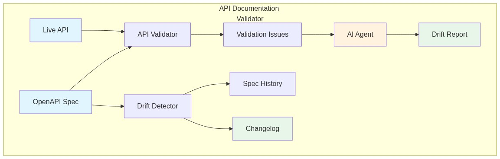
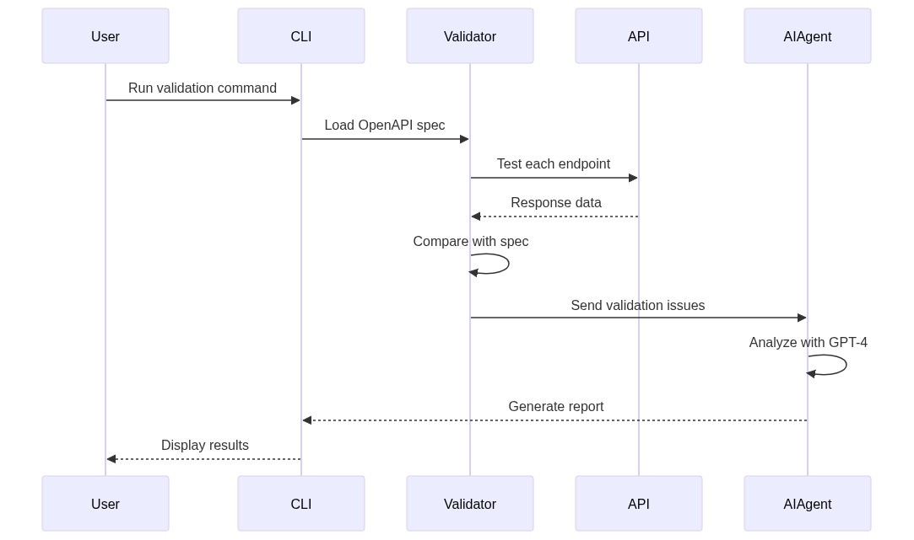
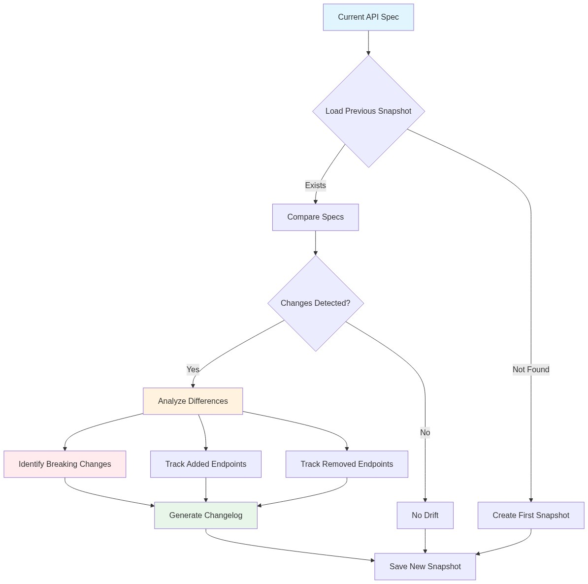

# AI-Powered API Documentation Validator


**Automatically detect drift between your OpenAPI specifications and actual API implementations using AI**



## Overview

In fast-paced development environments, API documentation often falls behind actual implementations. This creates confusion, breaks integrations, and wastes developer time. The **AI-Powered API Documentation Validator** solves this problem by automatically comparing your OpenAPI specifications against live API behavior and using GPT-4 to provide intelligent insights about discrepancies.

### The Problem

- APIs evolve faster than documentation
- Manual spec updates are error-prone and time-consuming
- Teams discover spec drift only when integrations break
- No automated way to track specification changes over time

### The Solution

This tool provides:
- **Automated Validation**: Test all API endpoints against OpenAPI specs
- **AI-Powered Analysis**: GPT-4 analyzes issues and suggests fixes
- **Drift Detection**: Track specification changes over time
- **Actionable Reports**: Get human-readable insights, not just error logs

## Features

### Core Validation
- Parse OpenAPI 3.0 specifications (YAML/JSON)
- Validate response status codes against spec
- Check response schemas for required fields
- Detect type mismatches and missing properties
- Support for path parameters and query parameters

### AI-Powered Insights
- Intelligent analysis of validation issues using GPT-4
- Prioritized recommendations for fixing drift
- Automatic spec correction suggestions
- Executive summaries for non-technical stakeholders

### Drift Detection
- Track specification changes over time
- Generate changelogs between versions
- Identify breaking changes automatically
- Maintain specification history

### Reporting
- Console output with color-coded severity levels
- JSON export for CI/CD integration
- Markdown reports for documentation
- Comprehensive drift analysis reports

## Installation

### Prerequisites

- Python 3.8 or higher
- OpenAI API key (for AI-powered features)
- Access to the API you want to validate

### Setup

1. **Clone the repository**
   ```bash
   git clone https://github.com/aniket-work/ai-api-validator.git
   cd ai-api-validator
   ```

2. **Install dependencies**
   ```bash
   pip install -r requirements.txt
   ```

3. **Configure environment variables**
   ```bash
   cp .env.template .env
   # Edit .env and add your OPENAI_API_KEY
   ```

## Usage

### Basic Validation

Validate your API against an OpenAPI specification:

```bash
python src/main.py validate \
  --spec examples/petstore_spec.yaml \
  --base-url https://petstore.swagger.io/v2
```

### AI-Powered Validation

Get intelligent insights using GPT-4:

```bash
python src/main.py validate \
  --spec examples/petstore_spec.yaml \
  --base-url https://petstore.swagger.io/v2 \
  --ai-analysis
```

### Detect Specification Drift

Track changes in your API specification over time:

```bash
python src/main.py detect-drift \
  --spec examples/petstore_spec.yaml \
  --changelog
```

### Generate Comprehensive Report

Create a detailed validation report with AI analysis:

```bash
python src/main.py generate-report \
  --spec examples/petstore_spec.yaml \
  --base-url https://petstore.swagger.io/v2 \
  --output validation_report.md
```

## Architecture



### Components

1. **API Validator** (`src/api_validator.py`)
   - Loads and parses OpenAPI specifications
   - Makes HTTP requests to test endpoints
   - Compares responses with spec definitions
   - Categorizes issues by severity

2. **AI Agent** (`src/ai_agent.py`)
   - Analyzes validation issues using GPT-4
   - Generates human-readable insights
   - Suggests specification corrections
   - Creates comprehensive drift reports

3. **Drift Detector** (`src/drift_detector.py`)
   - Captures specification snapshots
   - Compares versions over time
   - Identifies breaking changes
   - Generates changelogs

4. **CLI** (`src/main.py`)
   - Command-line interface for all features
   - Supports multiple output formats
   - Integrates all components

## Configuration

### Environment Variables

Create a `.env` file with:

```env
OPENAI_API_KEY=your_openai_api_key_here
```

### OpenAPI Specification

Your OpenAPI spec should be valid OpenAPI 3.0 format. Example:

```yaml
openapi: 3.0.0
info:
  title: My API
  version: 1.0.0
paths:
  /users/{id}:
    get:
      parameters:
        - name: id
          in: path
          required: true
          schema:
            type: integer
      responses:
        '200':
          description: Success
          content:
            application/json:
              schema:
                type: object
                required:
                  - id
                  - name
                properties:
                  id:
                    type: integer
                  name:
                    type: string
```

## Output Examples

### Console Output

```
================================================================================
API VALIDATION REPORT
================================================================================

Specification: examples/petstore_spec.yaml
Base URL: https://petstore.swagger.io/v2

Total Issues: 3
  Critical: 0
  Errors: 1
  Warnings: 2
  Info: 0

DETAILED ISSUES:
--------------------------------------------------------------------------------

1. [ERROR] GET /pet/{petId}
   Missing required property: category
   Expected: ['id', 'name', 'category']
   Actual: ['id', 'name', 'photoUrls']

2. [WARNING] GET /pet/findByStatus
   Unexpected status code: 500
   Expected: ['200', '400']
   Actual: 500
```

### AI Analysis Output

```
================================================================================
AI-POWERED ANALYSIS
================================================================================

Executive Summary:
The API has moderate drift from its specification. One critical schema mismatch
and two warnings require attention before the next release.

Critical Issues:
1. The /pet/{petId} endpoint is missing the required 'category' field in responses.
   This is a contract violation that will break client integrations.

Recommendations:
- Update the OpenAPI spec to make 'category' optional, or
- Modify the API implementation to always include 'category' in responses
- Add automated spec validation to your CI/CD pipeline
```

## CI/CD Integration

### GitHub Actions Example

```yaml
name: API Spec Validation

on: [push, pull_request]

jobs:
  validate:
    runs-on: ubuntu-latest
    steps:
      - uses: actions/checkout@v2
      - name: Set up Python
        uses: actions/setup-python@v2
        with:
          python-version: '3.9'
      - name: Install dependencies
        run: pip install -r requirements.txt
      - name: Validate API
        env:
          OPENAI_API_KEY: ${{ secrets.OPENAI_API_KEY }}
        run: |
          python src/main.py validate \
            --spec openapi.yaml \
            --base-url ${{ secrets.API_BASE_URL }} \
            --output validation_report.json \
            --format json
```

## Drift Detection Workflow



The drift detector maintains a history of your API specifications:

1. **First Run**: Creates initial snapshot
2. **Subsequent Runs**: Compares with previous snapshot
3. **Change Detection**: Identifies added/removed/modified endpoints
4. **Breaking Changes**: Flags critical changes that break compatibility
5. **Changelog**: Generates human-readable change summary

## Use Cases

### Development Teams
- Catch spec drift during development
- Ensure documentation stays current
- Prevent integration breakages

### API Governance
- Enforce API standards across teams
- Track API evolution over time
- Audit compliance with specifications

### DevOps/SRE
- Validate APIs in CI/CD pipelines
- Monitor production API behavior
- Detect unexpected changes

### Technical Writers
- Verify documentation accuracy
- Identify undocumented changes
- Generate changelog content

## Limitations

- Requires live API access for validation
- AI features require OpenAI API key (costs apply)
- Basic schema validation (not full JSON Schema support)
- Does not test authentication flows
- Limited to OpenAPI 3.0 format

## Roadmap

- [ ] Support for OpenAPI 3.1
- [ ] Full JSON Schema validation
- [ ] Authentication flow testing
- [ ] GraphQL support
- [ ] Web UI dashboard
- [ ] Slack/Teams notifications
- [ ] Historical trend analysis

## Contributing

Contributions are welcome! Please feel free to submit a Pull Request.

1. Fork the repository
2. Create your feature branch (`git checkout -b feature/AmazingFeature`)
3. Commit your changes (`git commit -m 'Add some AmazingFeature'`)
4. Push to the branch (`git push origin feature/AmazingFeature`)
5. Open a Pull Request

## License

This project is licensed under the MIT License - see the LICENSE file for details.

## Acknowledgments

- OpenAPI Initiative for the specification standard
- OpenAI for GPT-4 API
- The open-source community for inspiration

## Support

For issues, questions, or contributions, please open an issue on GitHub.

---

**Built with ❤️ for developers who value accurate API documentation**
